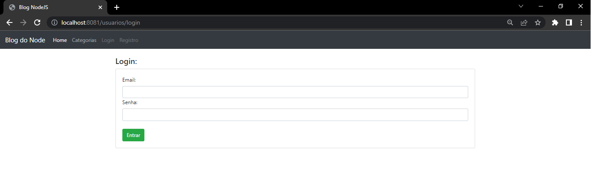
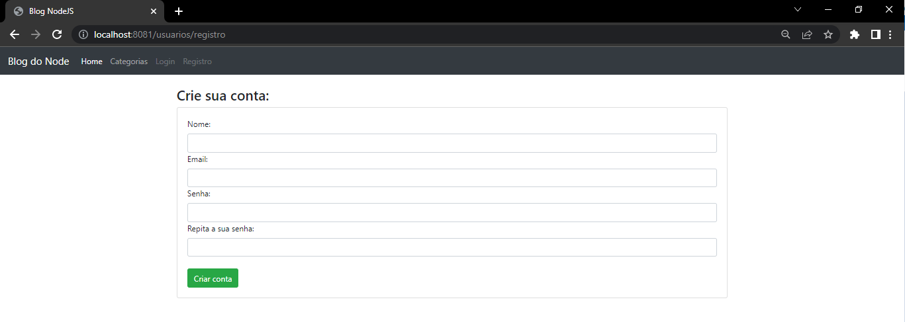

<h1 align="center">Blog com Node.js + Express + MongoDB</h1>

Curso prático pelo Youtuber [Victor Lima](https://www.youtube.com/watch?v=LLqq6FemMNQ&list=PLJ_KhUnlXUPtbtLwaxxUxHqvcNQndmI4B) - canal: Victor Lima - Guia do Programador, trabalhando com Node.js. Desenvolvido uma aplicação web utilizando o framework Express.js e Mongoose, uma biblioteca de modelagem de dados de objeto, facilita o gerenciamento de relacionamentos de dados e fornece validação de esquema para objetos do MongoDB.

Node.js permite a execução de códigos Javascript fora de um navegador web.


<br><br>

<br><br>


## Início

Realizado um blog para publicar conteúdos, podendo filtrar por categoria. Realizado sistema de cadastro de usuário e classificando como administrador. 

## Pré-requisitos:

Você precisa do NodeJS e do NPM instalado em sua máquina e suas dependências.

```
npm install --save express
npm install --save express-handlebars 
npm install body-parser --save
npm install --save mongoose
npm install --save express-session
npm install --save connect-flash
npm install --save bcryptjs
npm install --save passport
npm install --save passport-local
```

## Construído com:

* [Node.js](https://nodejs.org/en/)
* [Bootstrap](https://getbootstrap.com/)
* [mongoose - mongoDB](https://www.mongodb.com/)

## Author:

* **Wallace Herlon** - [LinkedIn](https://www.linkedin.com/in/wallaceherlon/)
